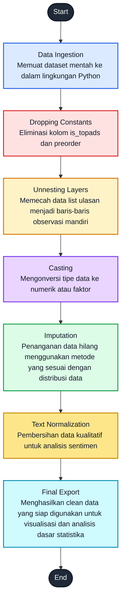

```mermaid
flowchart TD
    A([Start]) --> B[Data Ingestion<br/>Memuat dataset mentah ke dalam lingkungan Python]
    B --> C[Dropping Constants<br/>Eliminasi kolom is_topads dan preorder]
    C --> D[Unnesting Layers<br/>Memecah data list ulasan menjadi baris-baris observasi mandiri]
    D --> E[Casting<br/>Mengonversi tipe data ke numerik atau faktor]
    E --> F[Imputation<br/>Penanganan data hilang menggunakan metode yang sesuai dengan distribusi data]
    F --> G[Text Normalization<br/>Pembersihan data kualitatif untuk analisis sentimen]
    G --> H[Final Export<br/>Menghasilkan clean data yang siap digunakan untuk visualisasi dan analisis dasar statistika]
    H --> I([End])

    classDef startEnd fill:#1f2937,color:#ffffff,stroke:#111827,stroke-width:2px;
    classDef ingestion fill:#dbeafe,stroke:#2563eb,stroke-width:2px,color:#111827;
    classDef dropping fill:#fee2e2,stroke:#dc2626,stroke-width:2px,color:#111827;
    classDef unnesting fill:#fef3c7,stroke:#d97706,stroke-width:2px,color:#111827;
    classDef casting fill:#e9d5ff,stroke:#7c3aed,stroke-width:2px,color:#111827;
    classDef imputation fill:#dcfce7,stroke:#16a34a,stroke-width:2px,color:#111827;
    classDef normalization fill:#fde68a,stroke:#ca8a04,stroke-width:2px,color:#111827;
    classDef export fill:#cffafe,stroke:#0891b2,stroke-width:2px,color:#111827;

    class A,I startEnd;
    class B ingestion;
    class C dropping;
    class D unnesting;
    class E casting;
    class F imputation;
    class G normalization;
    class H export;
```